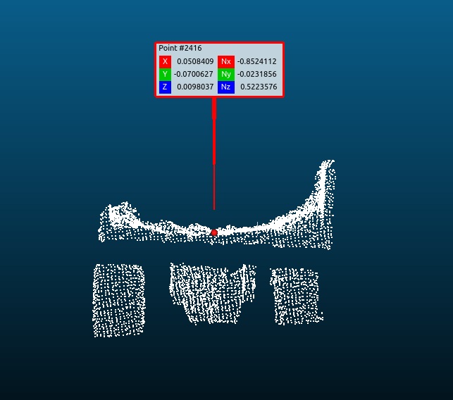

# v_hezhenpeng-truck_pose_estimation
Match the object(truck) in the scene through by given template, and output **T: object --- > template**


## Getting Started

### Prerequisites


```
PCL >= 1.7
yaml-cpp (https://github.com/jbeder/yaml-cpp)
```

### Building

```
mkdir build && cd build && cmake .. && make -j4
```


## Running the tests


Download the sample [data](https://ecloud.baidu.com?t=377036bef52c1a8d855f6bc5129c832f)


**For Match** you should run
```
./match truck_back_model.pcd truck_back_scene.pcd
```
```
Enter **SPACE** to show/hide the model
```

---

**For Track** you should run

```
./track r_model_s.pcd {.pcd folder} r_model_s.pcd
```

r_model_s.pcd -> the model used to match the point cloud

{.pcd folder} -> the data you want to track

truck_r.pcd   -> the model you want to show(you can repalce it with **r_model_s.pcd**)

```
Enter **Q** to quit the first window which show the initial guess
Enter **SPACE** to start tracking
```


## Built With

* [Zhenpeng](v_zhenpeng@baidu.com) - The Email Adress

## Versioning
Ground Segmentation ---> RANSAC ---> ICP ---> Tracking

## Acknowledgments

* Only **simple** tmplate && **uncalibrated** T: lidar--->template available!
* T: lidar--->template could be thinking as **Identity**(0,0,0,0,0,0,1)
  



